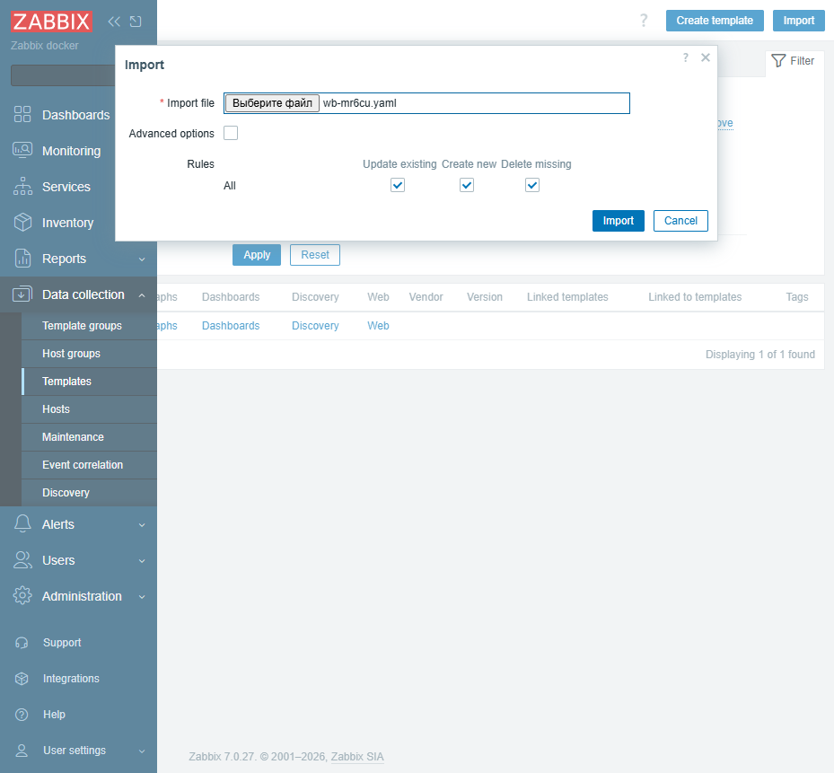
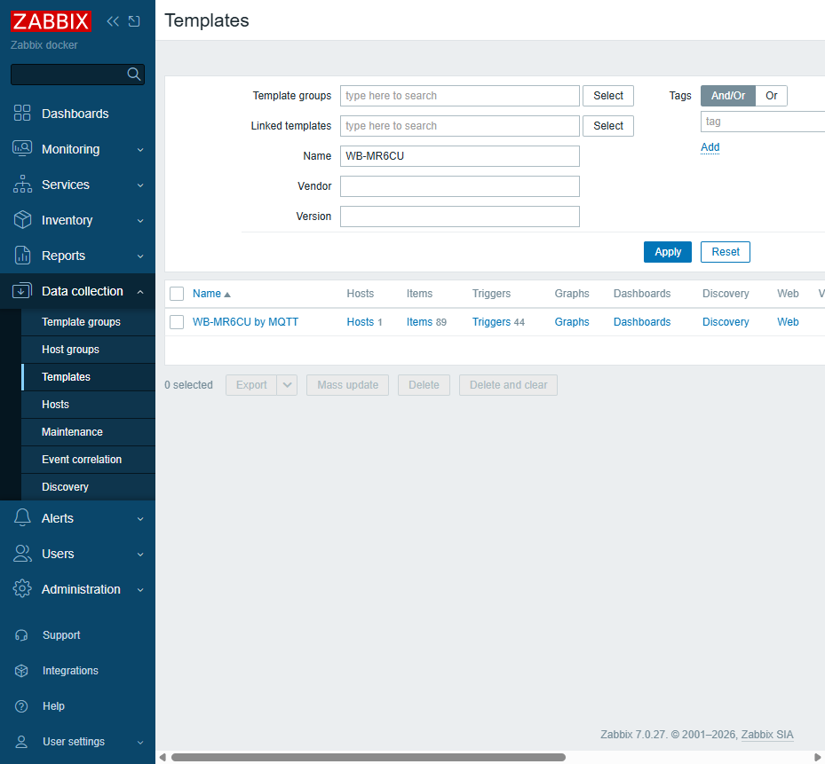
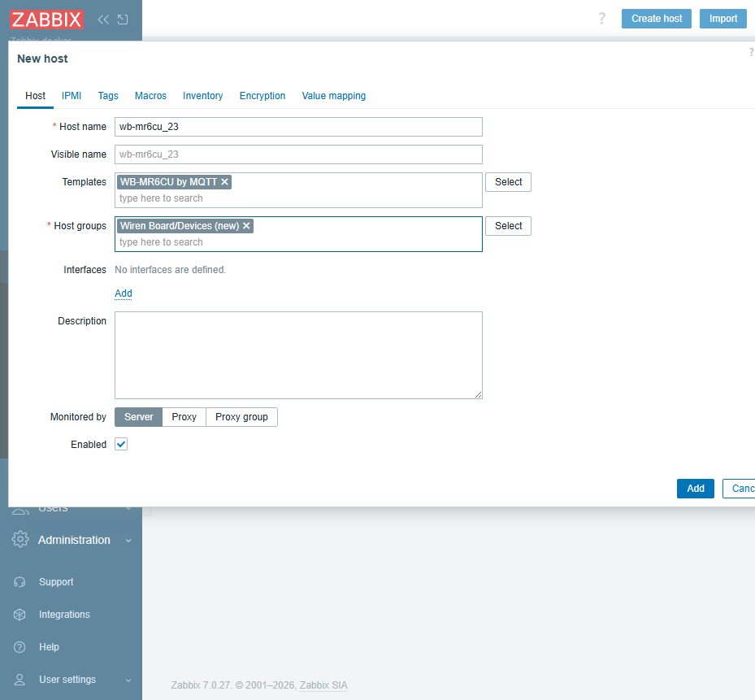
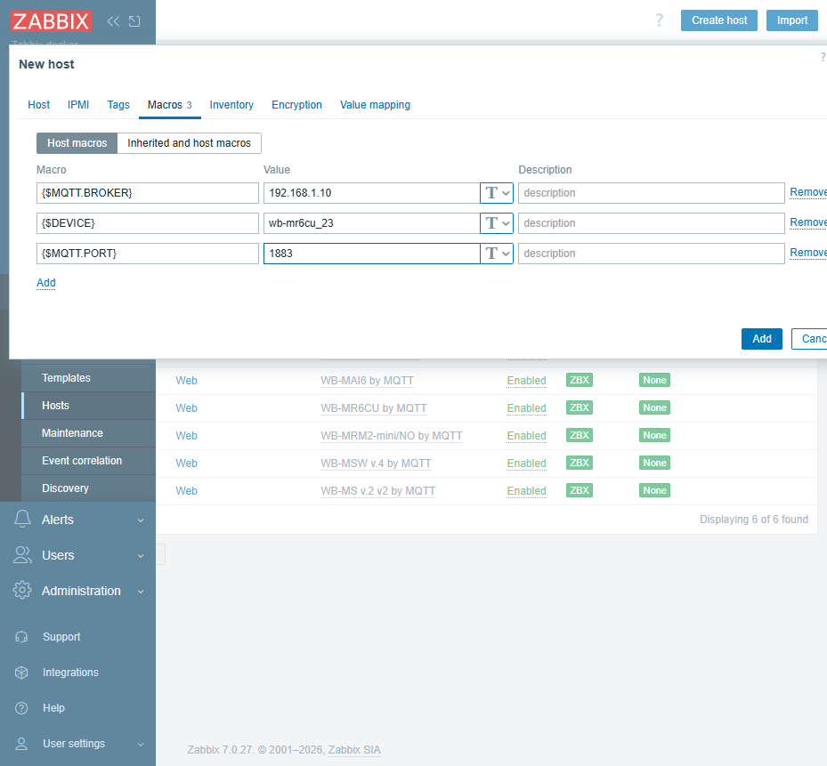
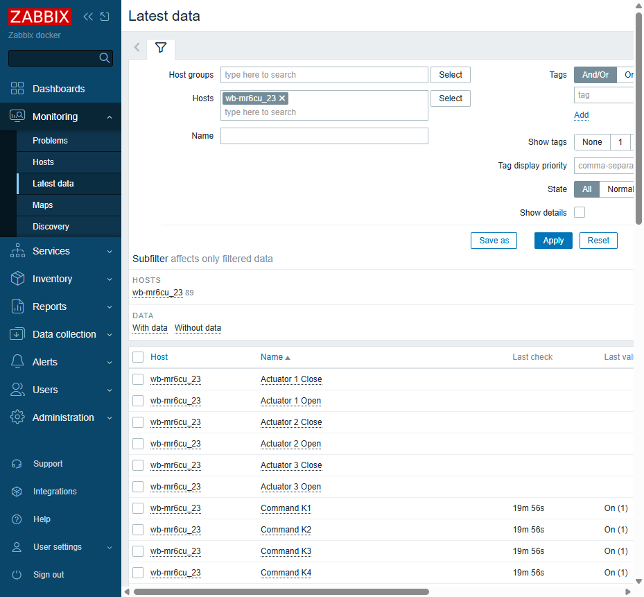

# wb-zabbix-templates

Wiren Board device templates for Zabbix.

Ready-to-use Zabbix templates for monitoring Wiren Board devices over MQTT. Each
template matches a device model and immediately gives you all of its controls in
Zabbix, plus triggers on control errors. Templates live in `templates/`, one file
per model.

## What's inside

- `templates/` — Zabbix templates per Wiren Board device model (YAML, Zabbix 7.0 import format).

## Requirements

- Zabbix 7.0 LTS or newer.
- Zabbix Agent 2 with the built-in MQTT plugin (7.0.10+ / 6.0.39+ recommended — these fix MQTT subscription bugs).
- Network access from the agent to the Wiren Board controller's MQTT broker (port 1883).

## How it works

Zabbix Agent 2 connects to the controller's MQTT broker and, via the `mqtt.get`
key, receives the stream of all topics of a device — `/devices/<device>/#`. A
single master item takes the stream, and dependent items split it into individual
controls. Ready values show up in **Latest data**; control errors (the
`/meta/error` topic) raise triggers.

## Usage

### 1. Import the template

Open **Data collection → Templates** and click **Import**. In the **Import file**
field choose the YAML of the model you need from `templates/`, for example
`wb-mr6cu.yaml`. Leave the **Rules** at their defaults — Zabbix will create new
objects and update existing ones (**Create new**, **Update existing**).

After import the template appears in the **Templates** list.

### 2. Create a host

Open **Data collection → Hosts** and click **Create host**.

- **Host name** — must match the `Hostname` the agent uses to identify itself to
  the server. For a package install this is the `Hostname=` parameter in
  `/etc/zabbix/zabbix_agent2.conf`; for Docker it is the `ZBX_HOSTNAME` variable.
  The master item is an active check, and the agent only collects it for the host
  whose name matches.
- **Templates** — link the model template you imported.
- **Host groups** — pick a group or create your own. A group is mandatory; access
  rights and filtering are based on it.

### 3. Set macros

Go to the **Macros** tab and set the host macros.

- `{$MQTT.BROKER}` — address of the controller's MQTT broker. If the agent runs on
  the controller itself, this is `127.0.0.1`. If the agent runs on a separate
  server, it is the controller's IP.
- `{$DEVICE}` — the device slug in MQTT, in the form `<model>_<slave_id>`, for
  example `wb-mr6cu_23`.
- `{$MQTT.PORT}` — broker port, `1883` by default. Change it only if the port
  differs.

### 4. Check the data

Open **Monitoring → Hosts**, find your host and click **Latest data** in its row
(or open **Monitoring → Latest data** and filter by host — it is the same screen).
Control values appear in the list. Controls the device does not publish stay empty
— this is not an error.

## Troubleshooting

**No data in Latest data.** Check that **Host name** exactly matches the agent's
`Hostname`, that the agent can see the server, and that the server can reach the
controller's broker at `{$MQTT.BROKER}`. The master item **MQTT raw stream** is an
active check and is intentionally hidden from **Latest data** — look at the
dependent control items instead.

**Some controls are empty.** A template covers the full set of controls of a model
as described in `wb-mqtt-serial`. A specific device does not publish all of them;
empty items can be disabled or hidden with the **With data** subfilter in **Latest
data**.

## License

MIT (see [LICENSE](LICENSE)).
